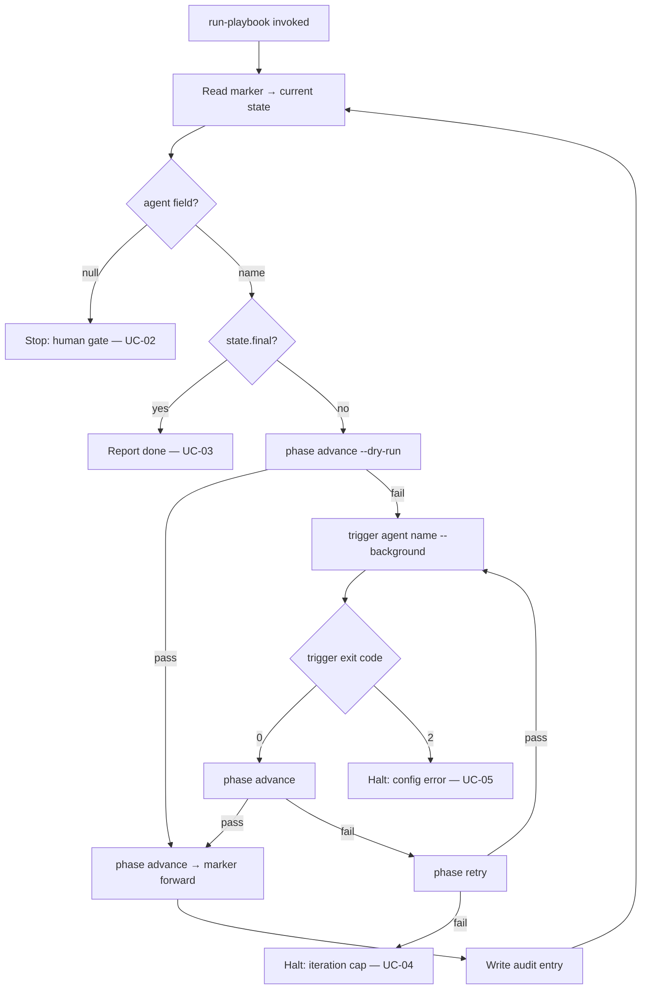

# UC-01 — Execute a Playbook Step

Realizes: AG-01

## Primary Actor

Human Operator (initiates `run-playbook`; the orchestrator acts mechanically on their behalf thereafter)

## Stakeholders & Interests

- **Human Operator** — wants agent sessions dispatched automatically without pressing "enter" between each phase, while retaining the guarantee that no phase is skipped or advanced without passing its gate.
- **AI Agent** — wants to receive the same prompt and context regardless of whether a human or the orchestrator dispatched it.
- **Gate Mechanism** (`phase advance`) — wants to remain the sole arbiter of whether a transition is valid; the orchestrator must not bypass or re-implement its checks.

## Trigger

The operator runs `run-playbook --playbook <name> [--from-state <state>] --cli <cli>`.

## Preconditions

- A playbook FSM exists at `factory/playbooks/<name>.fsm.yml`.
- The marker exists at `.current-work/playbook-state.yml`, or `--from-state` is provided to bootstrap it.
- The current state has `agent: <name>` (not null, not final).
- `config/model.conf` maps the agent's tier to a model for the chosen CLI.

## Main Success Scenario

01. Orchestrator reads the marker to determine the current FSM state.
02. Orchestrator reads the FSM to resolve the agent name for the current state.
03. Orchestrator calls `phase advance --dry-run` to check whether the out-gate is already satisfied.
04. Dry-run fails (gate not yet met) — orchestrator proceeds to dispatch.
05. Orchestrator calls `trigger agent <name> --background --cli <cli>`.
06. Orchestrator blocks until trigger returns exit code 0.
07. Orchestrator calls `phase advance`.
08. `phase advance` succeeds — marker advances to the next state.
09. Orchestrator writes an audit entry (timestamp, state, agent, exit code, duration).
10. Orchestrator processes the next state (self-chain): return to step 1.

## Extensions

- **3a. Dry-run succeeds (out-gate already satisfied)**
  - 3a1. Orchestrator calls `phase advance` (real, not dry-run) to write the marker forward.
  - 3a2. Orchestrator proceeds to next state (step 10) without dispatching.
- **6a. Trigger returns exit code 2 (resolution/config error)**
  - 6a1. Orchestrator halts immediately (UC-05).
- **7a. `phase advance` fails (out-gate not met after dispatch)**
  - 7a1. Orchestrator calls `phase retry`.
  - 7a2. `phase retry` succeeds (cap not hit): orchestrator re-dispatches same agent (return to step 5).
  - 7a3. `phase retry` fails (cap hit): orchestrator halts (UC-04).
- **2a. State has `agent: null`**
  - 2a1. Orchestrator stops at human gate (UC-02).
- **2b. State has `final: true`**
  - 2b1. Orchestrator reports completion (UC-03).

## Postconditions

- **Success Guarantee**: the marker has advanced to the next state; the dispatched agent completed; the out-gate was satisfied; an audit entry records the step.
- **Minimal Guarantee**: the marker is unchanged from its pre-step value (either the agent failed and the gate held, or a halt was triggered); no partial marker state is possible.

## Business Rules

- **BR-O01**: The orchestrator delegates all sequencing decisions to `phase advance` and `phase retry`. It holds no sequencing logic of its own.
- **BR-O02**: The orchestrator delegates all gate evaluation to `phase advance`. It evaluates no conditions itself.
- **BR-O03**: The orchestrator delegates all agent resolution and prompt composition to `trigger`. It composes no prompts.
- **BR-O04**: An agent session dispatched by the orchestrator is indistinguishable from one dispatched by a human. The prompt is the agent definition file, unmodified.
- **BR-O05**: The orchestrator never writes the marker directly. Only `factory/scripts/phase` writes the marker.

## Activity Diagram



## Acceptance Criteria

```gherkin
Feature: Execute a playbook step

  Scenario: Dispatch agent and advance on success
    Given a marker at state PHASE_2_ARCHITECTURE
    And the FSM assigns architecture-agent to that state
    And trigger returns exit code 0
    And phase advance succeeds after dispatch
    When the orchestrator processes the step
    Then trigger is called with agent architecture-agent
    And the marker advances to PHASE_2_GATE
    And an audit entry is written

  Scenario: Skip dispatch when out-gate already satisfied
    Given a marker at state PHASE_2_ARCHITECTURE
    And phase advance --dry-run succeeds (outputs already exist)
    When the orchestrator processes the step
    Then trigger is never called
    And the marker advances to PHASE_2_GATE

  Scenario: Retry when out-gate fails after dispatch
    Given a marker at state PHASE_2_ARCHITECTURE
    And trigger returns 0 but phase advance fails (findings open)
    And phase retry succeeds (iteration 2 of 5)
    When the orchestrator processes the step
    Then trigger is called a second time
```
