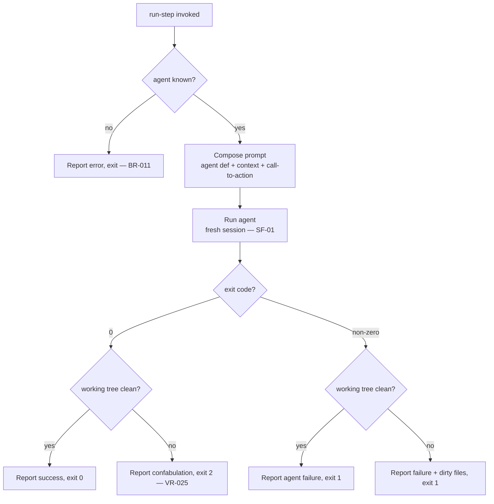

# UC-01 — Run a Single Agent Step

> **Superseded 2026-07-12 (PhaseRunner collapse):** the orchestrator no longer drives agent execution. This flow moved to `factory/` — see the repo-root [docs/spec/prd.md](../../../../docs/spec/prd.md) and [docs/adr/0002-factory-owns-flow-control-orchestrator-is-a-trigger.md](../../../../docs/adr/0002-factory-owns-flow-control-orchestrator-is-a-trigger.md). This use case is retained for traceability and history; the orchestrator no longer implements it.

Realizes: AG-01

## Primary Actor

Operator

## Stakeholders & Interests

- **Operator** — wants one agent's output produced in a clean session without running the whole loop, e.g. to re-run a step by hand.
- **Downstream steps** — want the artifact produced by the same isolated mechanism the full chain uses.

## Trigger

The Operator runs `orchestrate run-step <agent>`.

## Preconditions

- The named agent exists in the agent registry (resolved from the package-relative `agents/` path).
- The agent's declared input artifacts exist.
- A CLI adapter is installed and authenticated.

## Main Success Scenario

1. Operator invokes `run-step` with an agent name.
2. Orchestrator composes the prompt from the agent definition plus project context, with a standalone call-to-action (FR-L3).
3. Orchestrator runs the agent in a fresh isolated session (SF-01).
4. The agent writes and commits its declared output artifacts (pre-commit hooks fire on each commit).
5. Orchestrator verifies the working tree is clean (gate, FR-D3).
6. Orchestrator reports the result and exits success.

## Extensions

- **3a. The named agent is unknown**
  - 3a1. Orchestrator reports the error and exits without launching any subprocess (BR-011).
- **4a. The subprocess exits non-zero or times out**
  - 4a1. If working tree is dirty, report failure and exit non-zero. `run-step` does not loop.
- **5a. Exit code 0 but working tree dirty (confabulation)**
  - 5a1. Orchestrator reports the trust violation and exits with code 2 (VR-025).
- **5b. Exit code non-zero but working tree clean**
  - 5b1. Orchestrator reports the agent failure and exits non-zero.

## Postconditions

- **Success Guarantee**: the agent's declared artifacts are committed on the current branch, all pre-commit hooks passed, and the working tree is clean.
- **Minimal Guarantee**: the Operator is told whether the step succeeded; no partial state is left undiagnosed.

## Business Rules

- **BR-005**: `run-step` runs an agent exactly once — it never loops or seeks approval. Its gate is the working-tree cleanliness check (FR-D3). It commits on the current branch (independent of run state).
- **BR-011**: an unknown agent name is rejected before any subprocess is launched.
- **BR-004** (session isolation) applies.

## Activity Diagram



## Acceptance Criteria

```gherkin
Feature: Run a single agent step

  Scenario: Successful single step
    Given a known agent whose inputs exist
    When the Operator runs run-step for that agent
    Then the orchestrator runs it in a fresh session
    And the agent commits its artifacts
    And the working tree is clean
    And it exits 0

  Scenario: Unknown agent is rejected early
    Given an agent name that does not exist
    When the Operator runs run-step for it
    Then the orchestrator reports the error
    And it does not launch any subprocess

  Scenario: Confabulation detected
    Given a known agent that exits 0 but leaves uncommitted changes
    When the Operator runs run-step
    Then the orchestrator reports the trust violation
    And it exits 2

  Scenario: Agent failure with dirty tree
    Given a known agent that exits non-zero with uncommitted changes
    When the Operator runs run-step
    Then the orchestrator reports the failure and dirty files
    And it exits 1
```
