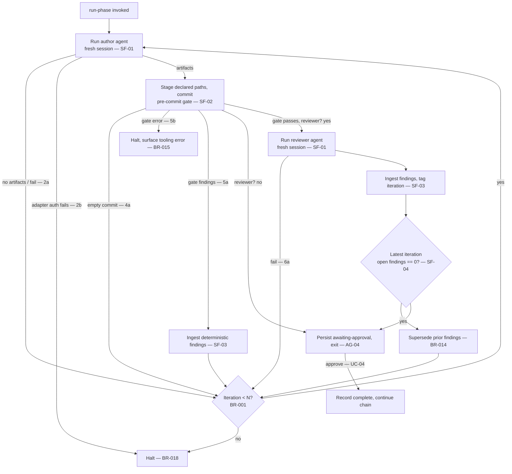

# UC-02 — Run a Phase to a Clean Review

> **Superseded 2026-07-12 (PhaseRunner collapse):** the orchestrator no longer drives agent execution. This flow moved to `factory/` — see the repo-root [docs/spec/prd.md](../../../../docs/spec/prd.md) and [docs/adr/0002-factory-owns-flow-control-orchestrator-is-a-trigger.md](../../../../docs/adr/0002-factory-owns-flow-control-orchestrator-is-a-trigger.md). This use case is retained for traceability and history; the orchestrator no longer implements it.

Realizes: AG-02

## Primary Actor

Operator

## Stakeholders & Interests

- **Operator** — wants the phase driven to a clean, gated review with minimal babysitting, and a clear halt if it cannot get there.
- **Downstream phase** — wants a phase whose gate passed and whose latest review has zero open findings before building on it.
- **Authoring agent** — wants precise, machine-readable findings to act on when looped back.

## Definitions

A **phase** has an **author agent** and an **optional reviewer agent** (see BR-006 in UC-03 for the four phases). A phase with a reviewer runs the author→gate→review loop below; a phase without a reviewer (e.g. planning) is complete when its gate passes (step 5 → step 9).

## Trigger

The Operator runs `orchestrate run-phase <phase>`.

## Preconditions

- The phase's input artifacts exist.
- `pre-commit` is installed and configured with the phase's gate hook.
- A CLI adapter is installed and authenticated.
- The orchestrator holds the single-run lock and the working tree is clean on the dedicated run branch (BR-016, BR-017).

## Main Success Scenario

01. Operator invokes `run-phase` for the phase.
02. Orchestrator runs the **author agent** in a fresh isolated session (SF-01).
03. Author writes the phase's expected output artifacts.
04. Orchestrator stages the phase's declared artifact paths and commits; `pre-commit` runs the gate hook (SF-02).
05. The gate passes — the hook exits zero (no error-severity findings; BR-002).
06. Orchestrator runs the **reviewer agent** in a fresh isolated session (SF-01), independent of authoring (BR-004).
07. The reviewer files its findings as `docs/findings/*.md`; the orchestrator reads the `open` ones and ingests them into the local store, each assigned an ID by the orchestrator (SF-03, BR-019) and tagged with the current cycle (ADR-0012). The local store is the loop's sole source of truth for this state; the filed markdown is the ingestion input it is projected from, not a second store (ADR-0019).
08. Orchestrator evaluates the loop condition (SF-04): the latest iteration produced zero open findings (BR-014).
09. Orchestrator writes phase status `awaiting-approval` to `.orchestrator/run.json` and exits, yielding to the phase gate (delegates to AG-04).
10. On a later `approve` (UC-04), the orchestrator records the phase complete and, in a chain, continues to the next phase.

## Extensions

- **2a. Author produces no artifacts, exits non-zero, or times out**
  - 2a1. Orchestrator counts an iteration (BR-001) and retries from step 2; on cap it halts (BR-003).
- **2b. Adapter authentication or availability fails**
  - 2b1. Orchestrator halts immediately without counting an author iteration and surfaces the adapter error (BR-018).
- **2c. Adapter reports a config error (bad model id / unknown flag)**
  - 2c1. Orchestrator halts immediately without counting an author iteration and surfaces the config error; it does not loop, because the error would repeat identically every retry (BR-020).
- **4a. Staging produces an empty commit (byte-identical artifacts)**
  - 4a1. Orchestrator treats it as "no progress", counts an iteration, and retries from step 2; on cap it halts (BR-016).
- **5a. Gate fails because the hook reports error-severity findings**
  - 5a1. Orchestrator ingests the deterministic findings (SF-03) and re-runs the author (step 2) with them as extra instruction, counting an iteration.
  - 5a2. On cap it halts and summons the Operator (BR-003).
- **5b. Gate errors (hook crash, tool exception, pre-commit missing) or the gate subprocess times out**
  - 5b1. Orchestrator halts immediately, does not count an author iteration, and surfaces the tooling error — this is not author-fixable (BR-015, BR-020 for the timeout).
- **5c. An auto-fixing hook rewrites files and exits non-zero**
  - 5c1. Orchestrator re-stages the modified files and re-commits once, rather than looping the author (BR-015).
- **6a. Reviewer exits non-zero or times out**
  - 6a1. Orchestrator counts an iteration and retries from step 6; on cap it halts (BR-003).
- **8a. The latest review iteration has open findings**
  - 8a1. Orchestrator supersedes the prior iteration's open findings, counts an iteration, and re-runs the author (step 2) with the open findings (BR-014, BR-001).
  - 8a2. On cap it halts and summons the Operator; findings are left `open` (BR-003).

## Postconditions

- **Success Guarantee**: the phase's artifacts are committed on the run branch, the gate passed, the latest review iteration has zero open findings, and `.orchestrator/run.json` records the phase `awaiting-approval` (then `complete` once approved).
- **Minimal Guarantee**: `.orchestrator/run.json` and the findings store, written atomically (BR-017), reflect the last completed iteration; no partial or uncommitted corruption is left behind; if the run halted, the Operator is told the reason.

## Business Rules

- **BR-001**: Loop-back is capped at N iterations per phase (default N=3, configurable).
- **BR-002**: The gate blocks only on error-severity findings; the phase's `pre-commit` hook exits non-zero if and only if at least one error-severity finding exists. Warning and info are recorded but non-blocking.
- **BR-003**: A phase is complete only when the latest review has zero open findings **and** the gate passed **and** the human approved. On cap exhaustion the orchestrator halts rather than proceeding.
- **BR-004**: Every agent invocation is context-isolated; a reviewer never inherits the author's session.
- **BR-014**: At the start of each authoring iteration the phase's prior `open` findings are marked `superseded`; the loop-exit condition considers only the findings of the latest review iteration.
- **BR-015**: A gate that *errors* (hook crash, missing tool, exception) halts the run immediately without counting an author iteration; a gate that *reports findings* loops the author. An auto-fixing hook's rewrite is re-staged and re-committed once, not looped.
- **BR-016**: A phase commits the declared artifact paths (the author agent's `outputs:`; see system-use-cases Phase artifacts) against a dedicated run branch from a clean tree; an empty commit is treated as "no progress" and counts an iteration.
- **BR-017**: Only one run may be active; the orchestrator holds a run lock and writes `run.json` and finding files atomically (write-then-rename).
- **BR-018**: An adapter authentication or availability failure halts the run without counting an author iteration.
- **BR-019**: Finding identifiers are assigned by an orchestrator-owned monotonic allocator on ingest; the two sources (`spec-lint`, reviewer) submit raw findings and never mint their own IDs.
- **BR-020**: A failure that is not author-fixable and would repeat identically on retry halts the run immediately without counting an author iteration, rather than looping the author to the cap. This covers an adapter **config error** (a bad model id or unknown flag, surfaced as `config_error`) and a **gate timeout**. It mirrors the auth-failure halt (BR-018) and the gate-error halt (BR-015), closing the "wasted-cost" gap where a deterministic error consumed all N iterations before halting.

## Activity Diagram



## Acceptance Criteria

```gherkin
Feature: Drive a phase to a clean, gated review

  Scenario: Clean on the first pass
    Given a phase whose inputs exist and whose gate hook is configured
    When the author produces a spec that passes the gate
    And the reviewer records zero open findings
    Then the orchestrator persists awaiting-approval and exits
    And on approve it records the phase complete

  Scenario: Loop back once, then clean
    Given the reviewer records two open findings on the first pass
    When the orchestrator supersedes them and re-runs the author
    And the second review records zero open findings
    Then the phase reaches awaiting-approval
    And the iteration count recorded is 2

  Scenario: Gate findings loop the author, gate errors halt
    Given a committed spec that produces a spec-lint error finding
    Then the orchestrator ingests the finding and re-runs the author
    But given the gate hook itself crashes
    Then the orchestrator halts without counting an author iteration

  Scenario: Cap exhaustion halts safely
    Given open findings still remain after N iterations
    When the iteration cap is reached
    Then the orchestrator halts and summons the Operator
    And it leaves the remaining findings open
    And it does not proceed to the next phase

  Scenario: A phase without a reviewer completes on a passing gate
    Given a phase configured with no reviewer agent
    When its gate passes
    Then the orchestrator persists awaiting-approval without running a review
```
