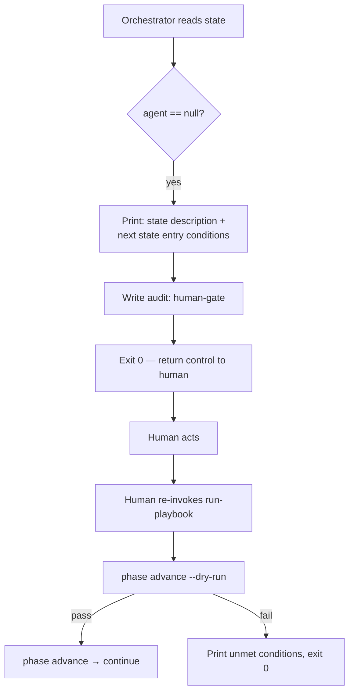

# UC-02 — Stop at a Human Gate

Realizes: AG-02

## Primary Actor

Human Operator

## Stakeholders & Interests

- **Human Operator** — wants to be clearly informed when a decision point requires their judgement, and wants to resume the run with a single re-invocation after acting.
- **Orchestrator** — wants to stop cleanly (not error) so that re-invocation picks up from the same state.

## Trigger

The orchestrator encounters a state where the FSM declares `agent: null`.

## Preconditions

- The marker points to a state with `agent: null` in the FSM.

## Main Success Scenario

01. Orchestrator reads the marker → current state.
02. Orchestrator reads the FSM → agent field is `null`.
03. Orchestrator prints the state's description and the next state's entry conditions (what the human needs to satisfy).
04. Orchestrator writes an audit entry with `action: human-gate`.
05. Orchestrator exits with code 0 (clean stop, not an error).
06. Human performs the required action (e.g., reviews backlog, approves, updates a finding status).
07. Human re-invokes `run-playbook`.
08. Orchestrator reads the marker → same state (unchanged since step 5).
09. Orchestrator calls `phase advance --dry-run`.
10. Dry-run succeeds (human's action satisfied the forward transition's entry conditions).
11. Orchestrator calls `phase advance` to write the marker forward.
12. Orchestrator continues to the next state (UC-01).

## Extensions

- **9a. Dry-run fails (human action not yet sufficient)**
  - 9a1. Orchestrator prints which conditions remain unmet.
  - 9a2. Orchestrator exits 0 again (still a clean stop, not an error).
  - 9a3. Human continues their work and re-invokes when ready.

## Postconditions

- **Success Guarantee**: human has been informed, the marker is unchanged until the human's action satisfies conditions, and re-invocation resumes cleanly.
- **Minimal Guarantee**: the orchestrator never dispatches an agent at a null-agent state; it always stops and returns control.

## Business Rules

- **BR-O06**: The orchestrator never bypasses a human gate. A state with `agent: null` always causes a clean stop.
- **BR-O07**: The stop at a human gate is exit code 0 (informational), not exit code 1 (error).

## Activity Diagram



## Acceptance Criteria

```gherkin
Feature: Stop at a human gate

  Scenario: Orchestrator stops at null-agent state
    Given a marker at state PHASE_3_APPROVAL
    And the FSM declares agent: null for that state
    When the orchestrator processes the step
    Then trigger is never called
    And the orchestrator prints the state description
    And the orchestrator exits with code 0

  Scenario: Resume after human action satisfies conditions
    Given a marker at state PHASE_3_APPROVAL
    And the human has satisfied the forward transition's entry conditions
    When the operator re-invokes run-playbook
    Then phase advance succeeds
    And the marker advances to PHASE_4_IMPLEMENTATION
```
