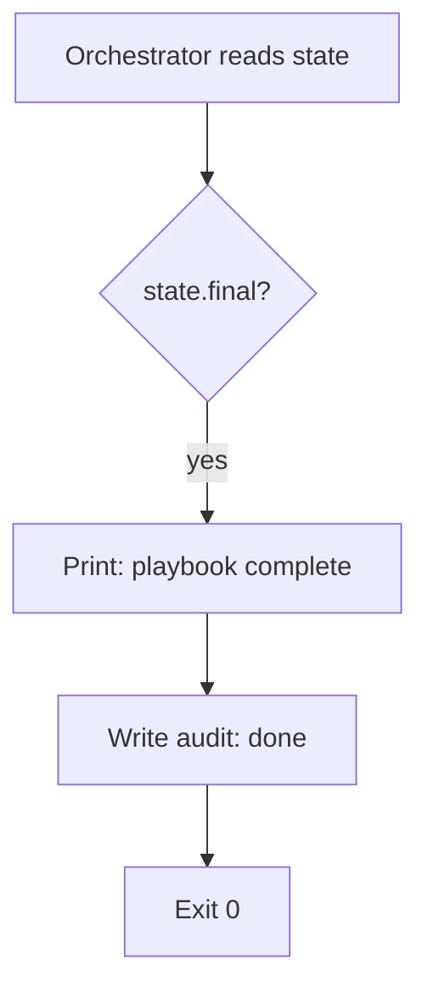

# UC-03 — Report Playbook Completion

Realizes: AG-03

## Primary Actor

Human Operator (receives the completion report)

## Stakeholders & Interests

- **Human Operator** — wants a clear, unambiguous signal that the playbook has run to completion and no further action is needed.

## Trigger

The orchestrator encounters a state where the FSM declares `final: true`.

## Preconditions

- The marker points to a state with `final: true` in the FSM.
- All entry conditions for that final state are satisfied (otherwise `phase advance` would not have moved the marker here).

## Main Success Scenario

1. Orchestrator reads the marker → current state.
2. Orchestrator reads the FSM → state has `final: true`.
3. Orchestrator prints: playbook name, final state name, and a completion confirmation.
4. Orchestrator writes an audit entry with `action: done`.
5. Orchestrator exits with code 0.

## Extensions

- None. A final state has no forward transition and no agent. The only action is to report and stop.

## Postconditions

- **Success Guarantee**: the marker remains at the final state; the audit log records completion; the operator has been informed.

## Business Rules

- **BR-O08**: Reaching a final state is always exit code 0. The orchestrator never treats completion as an error.
- **BR-O09**: The marker is not deleted or reset on completion. It remains as evidence of the last successful run.

## Activity Diagram



## Acceptance Criteria

```gherkin
Feature: Report playbook completion

  Scenario: Orchestrator reports done at final state
    Given a marker at state DONE with final: true
    When the orchestrator processes the step
    Then the orchestrator prints a completion message naming the playbook
    And an audit entry with action done is written
    And the orchestrator exits with code 0
    And the marker file still exists unchanged
```
