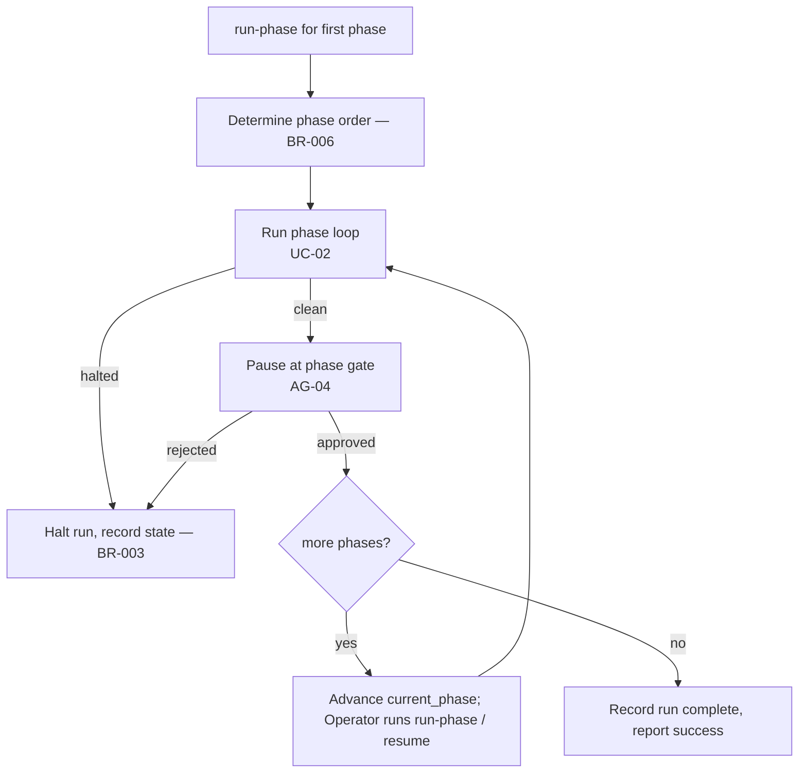

# UC-03 — Drive the Chain Phase by Phase

Realizes: AG-03

## Primary Actor

Operator

## Stakeholders & Interests

- **Operator** — wants the whole project driven through every phase in dependency order, running one phase at a time and intervening only at approval gates.
- **Downstream consumers** — want each phase gated and approved before the next begins.

> **Deferred scope.** A single-command, automated full-chain run (`run-all`) and unattended autonomy (a Scheduler running the chain headlessly with `--yes`) are **deferred**, not part of this scope. They return when the orchestrator gains a messaging channel or Web-UI through which a human can observe and approve a running chain remotely (see [prd.md](../prd.md) Deferred scope, [todos.md](../todos.md) T-36). Until then the Operator sequences the phases manually and every run is human-attended.

## Trigger

The Operator runs `orchestrate run-phase <phase>` for each phase, in dependency order, approving each gate before starting the next.

## Preconditions

- The initial phase's inputs exist (at minimum a vision or PRD to start requirements).
- `pre-commit` is configured with each phase's gate hook.
- A CLI adapter is installed and authenticated.

## Main Success Scenario

1. Operator runs `run-phase` for the first phase in the fixed order (BR-006).
2. Orchestrator acquires the single-run lock and creates or selects the dedicated run branch (BR-016, BR-017), then drives that phase's author↔reviewer loop to a clean review (UC-02); a phase with no reviewer completes on a passing gate.
3. At the phase gate the orchestrator pauses for approval (delegates to AG-04).
4. On approval, the orchestrator advances `current_phase` to the next phase and pauses; the Operator runs `run-phase` (or `resume`) to continue.
5. The Operator repeats steps 1–4 for each remaining phase in order.
6. After the final phase is approved, the orchestrator records the run complete and reports success.

## Extensions

- **2a. A phase cannot reach a clean review within its cap**
  - 2a1. Per UC-02 / BR-003 the phase halts; the run halts at that phase and records state for resume (AG-06).
- **3a. The Operator rejects a phase gate**
  - 3a1. The run halts at that phase (BR-012); it can be resumed after the Operator addresses the concern.
- **\*a. The run is interrupted (crash or manual stop)**
  - \*a1. The run is resumable from its last checkpoint via UC-06.

## Postconditions

- **Success Guarantee**: every phase is complete, gated, and approved; `.orchestrator/run.json` records the run complete.
- **Minimal Guarantee**: `.orchestrator/run.json` records the last completed phase and the current phase's iteration; the run can be resumed, or the halt reason is reported.

## Business Rules

- **BR-006**: the chain has four phases in fixed dependency order — **requirements** (author `requirements-agent`, reviewer `spec-review-agent`), **architecture** (author `architecture-agent`, reviewer `architecture-review-agent`), **planning** (author `planning-agent`, no reviewer), **implementation** (author `implementation-agent`, reviewer `qa-agent`). A phase starts only after the previous phase is complete.
- **BR-003** (halt on cap exhaustion) and **BR-012** (a rejection never silently proceeds) apply.
- **BR-021**: The planning phase assigns each story a `tier` — `economy`, `standard`, or `strong` — the model strength its work needs. Model selection resolves that declared tier directly against `model.conf` for the active CLI. Precedence is fixed: an explicit `--model` overrides `model.conf`, which overrides the adapter default. There is no per-story model field beyond `tier` itself — an operator tunes by editing it, keeping the backlog CLI-agnostic.

## Activity Diagram



## Acceptance Criteria

```gherkin
Feature: Drive the chain phase by phase

  Scenario: Clean run through every phase
    Given every phase can reach a clean review
    When the Operator runs run-phase for each phase in order and approves each gate
    Then the orchestrator advances through all phases in order
    And it reports the run complete after the final approval

  Scenario: A phase halts and stops the run
    Given a phase that cannot reach a clean review within its cap
    When the orchestrator reaches that phase
    Then the run halts at that phase
    And the state is recorded for resume

  Scenario: Rejecting a gate stops the run
    Given a phase that reached a clean review
    When the Operator rejects its gate
    Then the run halts at that phase
    And it does not advance to the next phase
```
