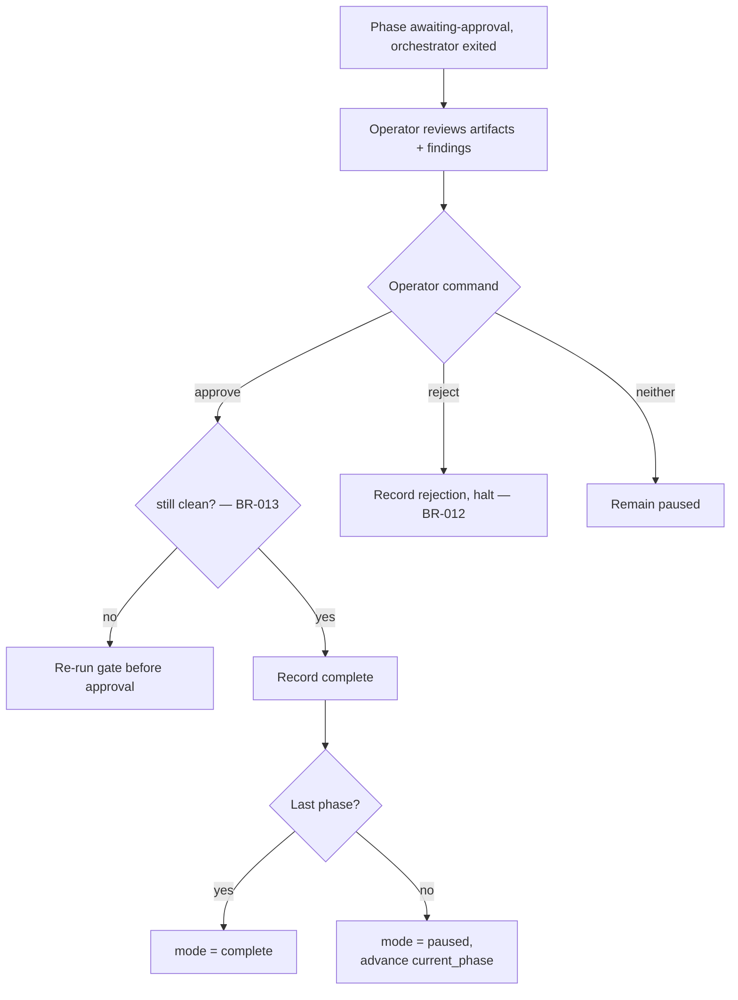

# UC-04 — Approve or Reject at a Phase Gate

Realizes: AG-04

## Primary Actor

Operator

## Stakeholders & Interests

- **Operator** — wants to exercise judgement on the semantic quality of a phase's output, which no linter can decide.
- **Next phase** — wants to start only from work a human has signed off.

## Trigger

The orchestrator has persisted phase status `awaiting-approval` and exited (UC-02 step 9). The Operator runs `orchestrate approve` or `orchestrate reject`.

## Preconditions

- The phase's gate passed and its latest-iteration open-findings count is zero — a phase reaches `awaiting-approval` only when it is mechanically clean (BR-007).

## Main Success Scenario

1. Operator reviews the phase's committed artifacts and the findings store (e.g. via `orchestrate status` and the branch diff).
2. Operator runs `orchestrate approve`.
3. Orchestrator re-verifies the gate passed and open findings == 0 (BR-007). For `empty-commit` phases, the gate-passed check is skipped — the operator is acknowledging the empty commit is acceptable (FAGAN-0038).
4. Orchestrator records the approval in `.orchestrator/run.json`, marking the phase `complete`.
5. If more phases remain, the orchestrator advances `current_phase` and sets `mode: paused` — the operator runs `resume` to continue the chain (FAGAN-0035). If this was the last phase, the run is marked `complete`.

## Extensions

- **2a. The Operator runs `reject` (optionally with a note)**
  - 2a1. Orchestrator records the rejection and halts; re-running the phase is a fresh Operator action (`run-phase` / `resume`), not an automatic loop-back (BR-012).
- **2b. The Operator does neither**
  - 2b1. The run stays paused with `awaiting-approval` persisted; no progression occurs.
- **3a. Re-verification finds the phase is no longer clean** (artifacts changed since the gate)
  - 3a1. Orchestrator refuses the approval and re-runs the gate before it can be approved (BR-013).

## Postconditions

- **Success Guarantee**: the approval is recorded, the phase is `complete`, and `current_phase` is advanced (or the run is complete). Mode is `paused` (not `running`) until the operator runs `resume`.
- **Minimal Guarantee**: the decision (approve, reject, or none) is recorded in `.orchestrator/run.json`; progression happens only on an explicit approval of a still-clean phase.

## Business Rules

- **BR-007**: a phase reaches `awaiting-approval` only when the gate passed and open findings == 0 — the Operator cannot approve a mechanically failing phase.
- **BR-012**: a rejection halts the run; it never silently proceeds and never auto-loops the author.
- **BR-003** and **BR-013** apply.

## Activity Diagram



## Acceptance Criteria

```gherkin
Feature: Approve or reject at a phase gate

  Scenario: Approval advances the run
    Given a phase persisted as awaiting-approval with zero open findings
    When the Operator runs approve
    Then the orchestrator marks the phase complete
    And it sets mode to paused with current_phase advanced
    And the Operator runs resume to continue the chain

  Scenario: Approval of empty-commit phase
    Given a phase awaiting approval with last_gate.hook = empty-commit
    When the Operator runs approve
    Then the orchestrator marks the phase complete without requiring a passing gate

  Scenario: Rejection halts without looping
    Given a phase awaiting approval
    When the Operator runs reject with a note
    Then the orchestrator records the rejection and halts
    And it does not automatically re-run the author

  Scenario: A stale phase cannot be approved
    Given a phase awaiting approval whose artifacts changed since the gate
    When the Operator runs approve
    Then the orchestrator re-runs the gate before allowing approval

  Scenario: A failing phase is never presented for approval
    Given a phase with open findings or a failed gate
    When the orchestrator evaluates the gate
    Then it does not persist awaiting-approval for that phase
```
