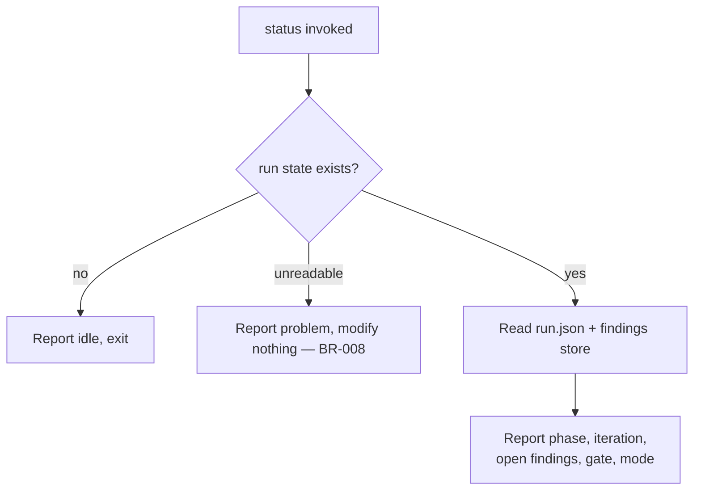

# UC-05 — Check Run Status

Realizes: AG-05

## Primary Actor

Operator

## Stakeholders & Interests

- **Operator** — wants to know where a run stands (phase, iteration, open findings, last gate) without changing anything.

## Trigger

The Operator runs `orchestrate status`.

## Preconditions

- None — status is safe to run in any state.

## Main Success Scenario

1. Operator invokes `status`.
2. Orchestrator reads `.orchestrator/run.json` and the findings store.
3. Orchestrator reports the current phase, iteration, open-findings count, last gate result, and run mode (running, paused, halted, or complete; idle when no run exists).

## Extensions

- **2a. No run state exists**
  - 2a1. Orchestrator reports "no active run" (idle) and exits.
- **2b. Run state is unreadable or corrupt**
  - 2b1. Orchestrator reports the problem and where to look; it modifies nothing (BR-008).

## Postconditions

- **Success Guarantee**: an accurate status is reported.
- **Minimal Guarantee**: no state is modified — the command is strictly read-only (BR-008).

## Business Rules

- **BR-008**: `status` is strictly read-only; it never mutates run state or the findings store.

## Activity Diagram



## Acceptance Criteria

```gherkin
Feature: Check run status

  Scenario: Reports an active run
    Given a run paused at a phase gate
    When the Operator runs status
    Then the orchestrator reports the phase, iteration, open findings, and mode

  Scenario: Reports idle when nothing is running
    Given no run state exists
    When the Operator runs status
    Then the orchestrator reports no active run

  Scenario: Corrupt state is handled read-only
    Given an unreadable run state file
    When the Operator runs status
    Then the orchestrator reports the problem
    And it modifies nothing
```
