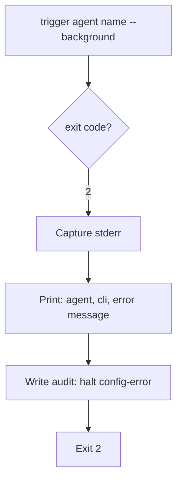

# UC-05 — Halt on Configuration Error

Realizes: AG-05

## Primary Actor

Human Operator (fixes the configuration)

## Stakeholders & Interests

- **Human Operator** — wants to know immediately that the failure is a configuration problem (not a work problem) and exactly what is misconfigured.
- **Orchestrator** — wants to distinguish a fixable config error from a retry-worthy work failure.

## Trigger

`trigger` returns exit code 2 (resolution error: unknown agent, missing model in `config/model.conf`, or broken FSM reference).

## Preconditions

- The orchestrator attempted to dispatch an agent via `trigger agent <name> --background --cli <cli>`.
- `trigger` could not resolve the agent, the tier-to-model mapping, or the CLI command.

## Main Success Scenario

1. Orchestrator calls `trigger agent <name> --background --cli <cli>`.
2. Trigger returns exit code 2.
3. Orchestrator captures trigger's stderr output (the resolution error message).
4. Orchestrator prints: the agent name, the CLI, and the error message.
5. Orchestrator writes an audit entry with `action: halt`, noting the config error.
6. Orchestrator exits with code 2.

## Extensions

- None. A config error is always immediate and fatal — no retry, no fallback.

## Postconditions

- **Success Guarantee**: the marker is unchanged; the human knows exactly what to fix (agent name, tier, CLI, model.conf entry); the audit trail records the error.
- **Minimal Guarantee**: the orchestrator never retries on a config error.

## Business Rules

- **BR-O12**: Exit code 2 from trigger is always fatal. The orchestrator never retries a resolution failure.
- **BR-O13**: The orchestrator's own exit code 2 means "configuration problem" — a distinct category from gate failure (exit 1) and success (exit 0).

## Activity Diagram



## Acceptance Criteria

```gherkin
Feature: Halt on configuration error

  Scenario: Unknown agent halts immediately
    Given the FSM declares agent: nonexistent-agent for the current state
    And trigger cannot resolve that agent name
    When the orchestrator dispatches
    Then trigger returns exit code 2
    And the orchestrator prints the resolution error
    And the orchestrator exits with code 2
    And no retry is attempted

  Scenario: Missing model.conf entry halts immediately
    Given the FSM declares agent: architecture-agent (tier: strong)
    And config/model.conf has no entry for claude.strong
    When the orchestrator dispatches
    Then trigger returns exit code 2
    And the orchestrator prints the missing-model error
    And the orchestrator exits with code 2
```
