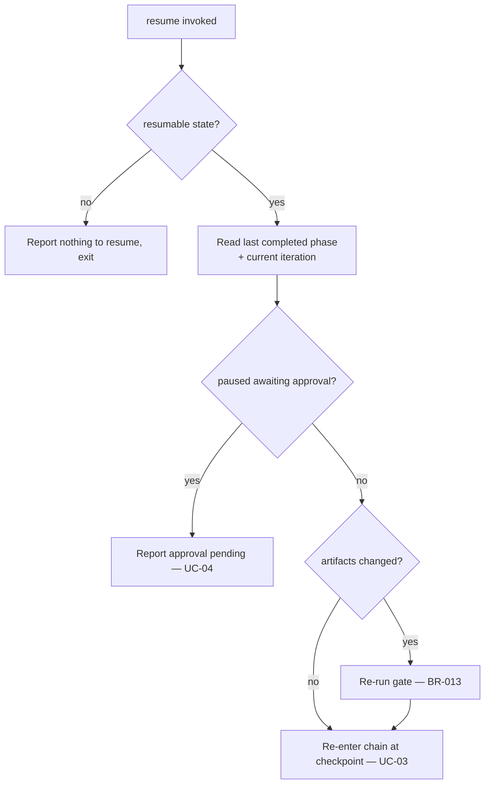

# UC-06 — Resume an Interrupted Run

Realizes: AG-06

## Primary Actor

Operator

## Stakeholders & Interests

- **Operator** — wants to continue a long run after a crash or manual stop without repeating approved work or corrupting state.

## Trigger

The Operator runs `orchestrate resume`.

## Preconditions

- A `.orchestrator/run.json` exists describing an incomplete run.

## Main Success Scenario

1. Operator invokes `resume`.
2. Orchestrator reads run state to find the last completed phase and the current phase's iteration.
3. Orchestrator re-enters the chain at the current phase and iteration without repeating any approved phase (BR-009).
4. Orchestrator continues per UC-03 / UC-02 from that point.

## Extensions

- **2a. No resumable state exists**
  - 2a1. Orchestrator reports there is nothing to resume and exits.
- **3a. The run is paused awaiting approval**
  - 3a1. Orchestrator reports that approval is pending and directs the Operator to `approve`/`reject` (UC-04); it does not auto-advance.
- **3b. Tracked artifacts changed since the checkpoint**
  - 3b1. Orchestrator re-runs the gate before continuing (BR-013).
- **3c. A crash left a partially-committed or half-staged tree**
  - 3c1. Orchestrator restores the tree to the last committed state on the run branch before continuing (BR-013).

## Postconditions

- **Success Guarantee**: the run continues from the checkpoint to completion or a new halt.
- **Minimal Guarantee**: no already-approved phase is repeated and no state is corrupted.

## Business Rules

- **BR-009**: resume never repeats an already-completed phase.
- **BR-013**: if tracked artifacts changed since the checkpoint, the gate is re-run before proceeding.
- **BR-003** applies.

## Activity Diagram



## Acceptance Criteria

```gherkin
Feature: Resume an interrupted run

  Scenario: Resume mid-phase
    Given a run interrupted during a phase loop
    When the Operator runs resume
    Then the orchestrator continues from the recorded iteration
    And it does not repeat any approved phase

  Scenario: Resume at a phase gate
    Given a run that was paused awaiting approval
    When the Operator runs resume
    Then the orchestrator re-presents the phase gate

  Scenario: Nothing to resume
    Given no resumable run state exists
    When the Operator runs resume
    Then the orchestrator reports there is nothing to resume
```
