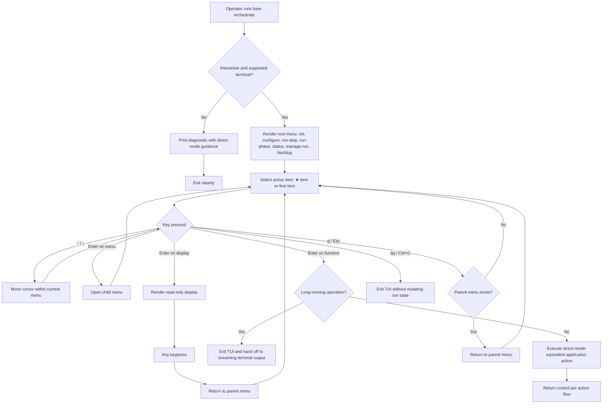

# UC-08 — Navigate the TUI Menu

**Primary Actor**: Operator
**Scope**: Agent Session Orchestrator
**Level**: User Goal

Realizes: AG-08, AG-13

## Stakeholders and Interests

- Operator: wants to discover the command surface, move through it predictably, and reach the desired action without memorising direct-mode syntax.
- Scheduler and shell-script users: want direct mode to remain unchanged when a subcommand is supplied or when menu mode cannot start.
- Project repository steward: wants menu navigation, inspection, and exit gestures to leave run state, findings, and logs untouched until the Operator explicitly dispatches a function.

## Preconditions

- The Operator runs `orchestrate` with no subcommand.
- Standard input and output are attached to a supported interactive terminal.
- The menu tree defined by `cli_specification.md` v1.2.0 is available to the application.

## Trigger

The Operator invokes `orchestrate` at the shell prompt.

## Main Success Scenario

01. The Operator runs `orchestrate` with no subcommand.
02. The system detects an interactive, supported terminal and enters menu mode.
03. The system renders the root menu with these items: `init`, `configure`, `run-step`, `run-phase`, `status`, `manage-run`, and `backlog`.
04. The system renders exactly one node at a time, marks the active item with the `-> ` cursor, and places the initial selection on the menu's pre-selected item when one is marked `★`.
05. The Operator presses `↑` or `↓` to move to the desired item in the current menu.
06. The system moves the selection within the current menu and invokes nothing.
07. The Operator presses Enter on the highlighted item.
08. If the highlighted item is a menu node, the system opens that child menu and repeats steps 4 through 7 until the Operator reaches the intended leaf.
09. The Operator presses Enter on the intended leaf.
10. The system dispatches the selected leaf according to its node type, preserving the same application semantics as the equivalent direct-mode command.
11. The Operator reaches the intended orchestrator function or read-only view through menu navigation.

## Extensions

- **1a.** The terminal is non-interactive or unsupported:
  1. The system does not start menu mode.
  2. The system prints a diagnostic that explains why menu mode is unavailable and directs the Operator to the direct-mode command surface.
  3. The system exits cleanly without mutating run state.
- **1b.** The Operator supplies a subcommand:
  1. The system bypasses menu mode.
  2. The system executes the requested direct-mode command with its existing semantics.
- **4a.** The opened menu has no item marked `★`:
  1. The system places the cursor on the first item in that menu.
- **7a.** The Operator presses `q` or `Esc` in a non-root menu:
  1. The system returns to the parent menu.
- **7b.** The Operator presses `q` or `Esc` at the root menu:
  1. The system leaves the root menu in place and waits for further input.
- **9a.** The selected leaf is a display node:
  1. The system renders the requested read-only content.
  2. On the next keypress, the system returns to the parent menu.
- **9b.** The selected leaf is a function node that starts a long-running operation:
  1. The system exits menu mode.
  2. The system invokes the same underlying application action used by direct mode.
  3. The system hands control to streaming terminal output for that operation.
- **9c.** The selected leaf is a function node that completes within menu mode:
  1. The system executes the corresponding application action.
  2. The system returns control according to that action's defined flow.
- **\*a.** The Operator presses `qq` or `Ctrl+C` at any menu depth:
  1. The system exits menu mode immediately.
  2. The system dispatches no function and mutates no run state.

## Postconditions

**Success Guarantee**: The Operator has reached the intended menu leaf; if that leaf is a function, the corresponding application action has been dispatched through the same handler used by direct mode, and if that leaf is a display, the requested read-only content has been shown.
**Minimal Guarantee**: If the use case ends before a function leaf is dispatched, the system exits or returns to a parent menu cleanly, and pure navigation or display activity leaves run state, findings, and logs unchanged.

## Business Rules

- **BR-030**: Bare `orchestrate` shall enter menu mode only when standard input and output are attached to a supported interactive terminal.
- **BR-031**: If menu mode cannot be initialised, the system shall degrade gracefully by printing a diagnostic with direct-mode guidance and exiting cleanly; it shall not attempt a partial or degraded text menu.
- **BR-032**: The TUI shall render exactly one node at a time; `-> ` marks the active item, a `★` item is pre-selected when present, and the first item is selected when no `★` item exists.
- **BR-033**: Menu navigation state is independent of run state. Cursor movement, menu entry, back navigation, display viewing, and TUI exit shall not mutate `.orchestrator/run.json`, findings, or logs. Only a dispatched function leaf may do so.
- **BR-034**: `q` and `Esc` are back-navigation gestures, not exit gestures. They return to the parent node when one exists, do nothing at the root menu, and never dispatch an action. Display nodes return to the parent on any keypress. `qq` and `Ctrl+C` exit menu mode immediately.
- **BR-035**: Menu mode is a presentation layer, not a second command surface. If the Operator supplies a subcommand, the CLI shall bypass menu mode and preserve the existing direct-mode semantics unchanged.
- **BR-036**: Every TUI function leaf shall dispatch to the same application service or handler as its direct-mode equivalent. If the function starts a long-running operation, the TUI shall terminate before streaming terminal output begins.

## Activity Diagram



## Acceptance Criteria

```gherkin
Feature: Navigate the TUI menu mode

  Scenario: Bare orchestrate opens the root menu on a supported terminal
    Given an interactive terminal that supports the TUI
    When the Operator runs orchestrate with no subcommand
    Then the system enters menu mode
    And it shows the root menu with init, configure, run-step, run-phase, status, manage-run, and backlog

  Scenario: Arrow keys move the selection without invoking an action
    Given the root menu is open
    When the Operator presses the down arrow
    Then the cursor moves to the next menu item
    And no command is executed

  Scenario: A menu opens on its default item when one exists
    Given a menu whose default choice is marked with ★
    When the menu opens
    Then the cursor starts on that ★ item

  Scenario: A menu without a default opens on its first item
    Given a menu with no item marked ★
    When the menu opens
    Then the cursor starts on the first item

  Scenario: A display node returns to its parent on the next keypress
    Given the Operator has selected a display node
    When the display is shown and the Operator presses any key
    Then the system returns to the parent menu
    And it does not mutate run state

  Scenario: q returns to the parent menu
    Given the Operator is in a nested menu
    When the Operator presses q
    Then the system returns to the parent menu

  Scenario: qq exits menu mode without dispatch
    Given the Operator is in a nested menu
    When the Operator presses qq
    Then the system exits menu mode
    And it does not dispatch any function

  Scenario: A long-running function leaf hands off to streaming output
    Given the Operator has highlighted a function leaf that starts a long-running operation
    When the Operator presses Enter
    Then the system exits menu mode
    And it invokes the same underlying action used by direct mode
    And terminal output begins streaming for that operation

  Scenario: Unsupported terminals degrade gracefully
    Given a non-interactive or unsupported terminal
    When the Operator runs orchestrate with no subcommand
    Then the system does not start menu mode
    And it prints a diagnostic that directs the Operator to direct-mode commands
    And it does not mutate run state

  Scenario: A supplied subcommand bypasses menu mode
    Given the Operator supplies a direct-mode subcommand
    When the CLI starts
    Then the system does not enter menu mode
    And it preserves the existing direct-mode command semantics
```
