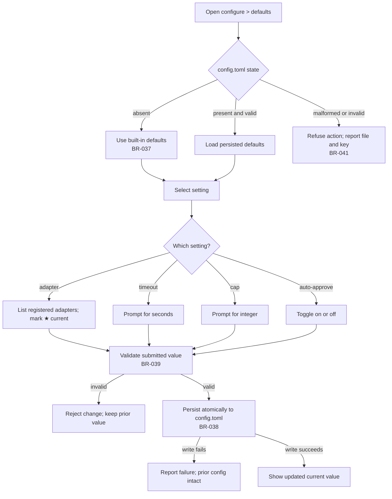

# UC-09 — Configure Persistent Defaults

Realizes: AG-09

## Primary Actor

Operator

## Stakeholders & Interests

- **Operator** — wants stable project defaults for routine invocations, so common settings need not be re-entered on every run.
- **Subsequent invocations** — want defaults resolved predictably, with explicit overrides still honoured.
- **Project maintainers** — want configuration changes validated, persisted safely, and diagnosable when broken.

## Trigger

The Operator enters menu mode and selects `configure > defaults`, then chooses one of: `adapter`, `timeout`, `cap`, or `auto-approve`.

## Preconditions

- The orchestrator is running in the project root and can address the project-local `.orchestrator/` state directory.
- The defaults menu is available in TUI mode.
- For the `adapter` action, at least one CLI adapter is registered.

## Main Success Scenario

1. Operator opens `configure > defaults`.
2. Orchestrator reads `.orchestrator/config.toml` if it exists; if it does not exist, the menu shows the built-in defaults as the current values (FR-Q5, BR-037, BR-040).
3. Operator selects one defaults action.
4. Orchestrator presents the setting-specific control:
   - `adapter` — list registered adapters, with the current default marked `★`.
   - `timeout` — prompt for a timeout in seconds.
   - `cap` — prompt for an integer iteration cap.
   - `auto-approve` — toggle on or off.
5. Operator submits the new value.
6. Orchestrator validates the submitted value against the setting's rules and current configuration context (FR-Q4, BR-039).
7. Orchestrator persists the validated value to `.orchestrator/config.toml`, creating the file on the first successful persist and writing it atomically (FR-Q1, FR-Q2, FR-Q4, FR-Q5, BR-037, BR-038).
8. Orchestrator returns to `configure > defaults` and shows the updated current value.
9. Subsequent invocations resolve that persisted value unless a later menu selection or CLI flag overrides it (FR-Q3, BR-040).

## Extensions

- **2a. `.orchestrator/config.toml` is absent**
  - 2a1. Orchestrator continues with built-in defaults and does not create the file merely by opening the menu (FR-Q5, BR-037).
- **2b. `.orchestrator/config.toml` is malformed or contains an invalid stored value**
  - 2b1. Orchestrator refuses the action, reports the offending file and key clearly enough for repair, and leaves configuration unchanged (FR-Q6, BR-041).
- **4a. No adapters are registered when `adapter` is selected**
  - 4a1. Orchestrator reports that no adapter can be chosen and leaves the default adapter unchanged.
- **6a. Submitted value fails validation**
  - 6a1. Orchestrator rejects the change, explains the violated constraint, and leaves the prior persisted value unchanged (BR-039).
- **7a. The atomic write cannot be completed**
  - 7a1. Orchestrator reports the persistence failure and preserves the pre-existing configuration exactly as it was before the attempted change (BR-038).

## Postconditions

- **Success Guarantee**: the selected default is validated and persisted in `.orchestrator/config.toml`; the file exists after the first successful persist; subsequent invocations can resolve the stored value through the defined precedence chain.
- **Minimal Guarantee**: no partial or ambiguous configuration is left behind; if the action fails, the prior configuration remains intact or, where no file existed, built-in defaults remain in force.

## Business Rules

- **BR-037**: Operator defaults are persisted in the project-local `.orchestrator/config.toml`. If the file is absent, the system uses built-in defaults and creates the file only on the first successful persist.
- **BR-038**: Writes to `.orchestrator/config.toml` are atomic. A failed persist shall not leave a partial file and shall not corrupt the previously stored configuration.
- **BR-039**: A default value must validate before persistence. `adapter` must name a registered adapter; `timeout` must be a positive integer number of seconds; `cap` must be an integer greater than or equal to 1; `auto_approve` must be a boolean.
- **BR-040**: Effective setting resolution follows a fixed four-layer precedence: `menu selection > CLI flag > config.toml > built-in default`.
- **BR-041**: If `.orchestrator/config.toml` is malformed or a stored key holds an invalid value, the system refuses the affected action and reports the offending file and key explicitly.

## Activity Diagram (Mermaid flowchart)



## Acceptance Criteria (Gherkin BDD)

```gherkin
Feature: Configure persistent defaults from the TUI

  Scenario Outline: Persisting a valid default setting
    Given the Operator is in the configure defaults menu
    And the current configuration is readable
    When the Operator changes <setting>
    Then the system validates the submitted value
    And it persists <key> in .orchestrator/config.toml
    And the updated value is shown as the current default

    Examples:
      | setting        | key           |
      | adapter        | adapter       |
      | timeout        | timeout       |
      | cap            | cap           |
      | auto-approve   | auto_approve  |

  Scenario: Creating the config file on first persist
    Given .orchestrator/config.toml does not exist
    When the Operator saves a valid timeout default
    Then the system creates .orchestrator/config.toml
    And it does not create the file before that successful save

  Scenario: Rejecting an invalid submitted value
    Given the Operator is changing the cap default
    When the Operator submits 0
    Then the system refuses the change
    And it explains that cap must be at least 1
    And the prior persisted value remains unchanged

  Scenario: Refusing action on malformed configuration
    Given .orchestrator/config.toml is malformed
    When the Operator opens configure defaults or attempts to save a change
    Then the system refuses the affected action
    And it reports the offending file and key clearly enough for repair
    And it leaves the stored configuration unchanged

  Scenario: Resolving settings by precedence
    Given .orchestrator/config.toml sets timeout to 900
    And a direct-mode invocation supplies --timeout 300
    And a menu-driven invocation selects timeout 120 for that run
    When the orchestrator resolves the effective timeout
    Then the effective value is 120
    And without the menu selection it would be 300
    And without the CLI flag it would be 900
    And with none of those layers present it would use the built-in default
```
