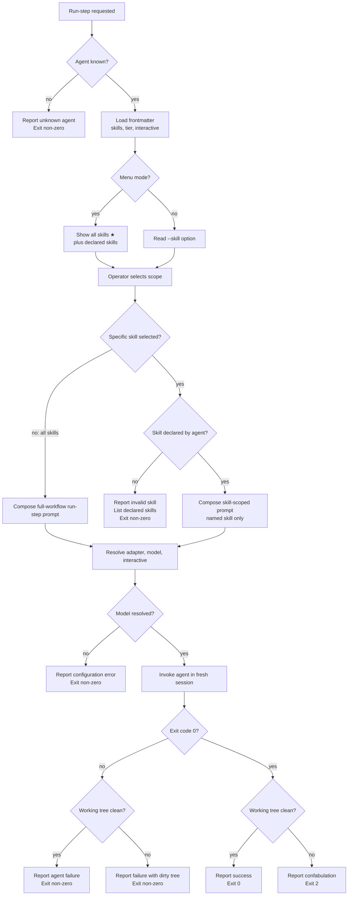

# UC-11 — Run a Skill-Scoped Agent Step

> **Superseded 2026-07-12 (PhaseRunner collapse):** the orchestrator no longer drives agent execution. This flow moved to `factory/` — see the repo-root [docs/spec/prd.md](../../../../docs/spec/prd.md) and [docs/adr/0002-factory-owns-flow-control-orchestrator-is-a-trigger.md](../../../../docs/adr/0002-factory-owns-flow-control-orchestrator-is-a-trigger.md). This use case is retained for traceability and history; the orchestrator no longer implements it.

Realizes: AG-11

## Scope

Agent Session Orchestrator

## Level

User Goal

## Primary Actor

Operator

## Supporting Actors

- **Agent registry** — supplies the selected agent's declared skills, tier, and interactive policy from frontmatter.
- **CLI adapter** — executes the composed invocation in a fresh session.
- **Model resolver** — resolves the default model from the agent's tier and the selected adapter's model dictionary (SF-08).

## Stakeholders & Interests

- **Operator** — wants to run one named skill without paying for or waiting on the agent's full workflow.
- **Agent author** — wants only declared skills to be runnable, so the orchestrator never targets an undocumented workflow step.
- **CLI adapter** — wants a fully validated invocation before launch: agent, scope, adapter, model, and interactive mode must already be resolved.
- **Repository and downstream steps** — want skill-scoped execution to preserve the same trust boundary as `run-step`: clean commits, clean working tree, and explicit failure on confabulation.

## Preconditions

- The named agent exists in the agent registry.
- The agent registry has parsed the agent's frontmatter, including `skills`, optional `interactive`, and `tier`.
- The selected adapter is installed and authenticated.
- The agent's declared input artifacts exist.
- A concrete model is available either from explicit override or from the agent's tier and the selected adapter's model dictionary.

## Postconditions

**Success Guarantee**: Exactly one agent invocation runs in a fresh isolated session. The invocation scope is explicit: either one declared skill or the full workflow sentinel `all skills`. Interactive mode is resolved from explicit override when present; otherwise from the agent's declared default. On success, the selected scope completes under `run-step` gate semantics: declared artifacts are committed as needed, pre-commit hooks pass, and the working tree is clean.

**Minimal Guarantee**: The Operator is told whether the request was rejected before launch or failed after launch. If the requested skill is invalid, the orchestrator launches no adapter subprocess. If execution fails, the orchestrator reports whether the failure arose from validation, model resolution, adapter execution, or gate verification.

## Trigger

- **Direct mode**: the Operator runs `orchestrate run-step <agent> --skill <skill>`.
- **Menu mode**: the Operator selects `run-step > {agent} > {specific skill} > {adapter} > {model}`.

## Main Success Scenario

01. The Operator selects `run-step` and identifies a known agent.
02. The orchestrator loads the agent's frontmatter metadata, including declared skills, tier, and interactive policy.
03. In menu mode, the orchestrator presents `all skills` as the default option, followed by the agent's declared skills.
04. The Operator selects one specific skill.
05. The orchestrator validates that the selected skill is declared in the agent's frontmatter.
06. The Operator selects an adapter and model, or accepts the defaults.
07. If no explicit model override is supplied, the orchestrator resolves the default model from the agent's tier and the selected adapter's model dictionary (SF-08).
08. The orchestrator resolves interactive mode: explicit override first; otherwise the agent's declared `interactive` policy.
09. The orchestrator composes a standalone `run-step` prompt from the agent definition, project context, and a skill-scoped call to action that instructs the agent to execute only the named skill's workflow step.
10. The orchestrator invokes the agent through the selected adapter in a fresh isolated session.
11. The agent executes the named skill's step, writes and commits its declared output artifacts, and exits.
12. The orchestrator verifies that the working tree is clean.
13. The orchestrator reports success and exits with code 0.

## Extensions

- **1a. The named agent is unknown**

  - 1a1. The orchestrator reports the error and exits non-zero without launching any subprocess.

- **3a. The agent declares no skills**

  - 3a1. In menu mode, the orchestrator presents only `all skills`.
  - 3a2. In direct mode, any `--skill` value is rejected before launch.

- **5a. The requested skill is not declared by the agent**

  - 5a1. The orchestrator reports the invalid skill, lists the agent's declared skills, and exits non-zero.
  - 5a2. No adapter subprocess is launched.

- **6a. The Operator accepts `all skills` or omits `--skill`**

  - 6a1. The orchestrator preserves the existing `run-step` behaviour and treats the invocation as a full agent workflow run.
  - 6a2. The completion check remains the standard `run-step` gate: successful exit plus a clean working tree.

- **7a. No concrete model can be resolved**

  - 7a1. The orchestrator reports a configuration error and exits non-zero without launching the adapter.

- **8a. An explicit interactive override is supplied**

  - 8a1. The orchestrator uses the override for this invocation only.
  - 8a2. The agent's declared `interactive` value remains unchanged for later invocations.

- **10a. The adapter invocation exits non-zero or times out**

  - 10a1. The orchestrator reports the failure.
  - 10a2. If the working tree is dirty, the orchestrator reports the dirty state as part of the failure.

- **12a. The agent exits 0 but leaves the working tree dirty**

  - 12a1. The orchestrator reports a trust violation and exits with code 2.

- **12b. The agent exits non-zero and the working tree is clean**

  - 12b1. The orchestrator reports agent failure and exits non-zero.

## Special Requirements

- The direct CLI shall accept `orchestrate run-step <agent> --skill <skill>` (FR-S1).
- Validation of `--skill` against the agent's declared frontmatter skills shall occur before any adapter invocation begins (FR-S2).
- Skill-scoped execution shall constrain the invocation to the selected skill's workflow step rather than the full workflow (FR-S3).
- In menu mode, `run-step > {agent}` shall present `all skills` plus each declared skill, with `all skills` as the default selection (FR-S4).
- The agent registry shall expose optional `interactive: true|false` frontmatter as the agent's default interactivity policy (FR-S5).
- Explicit `--interactive` or an equivalent menu override shall apply only to the current invocation; otherwise the agent default shall apply (FR-S6).

## Technology and Data Variations

- **Direct mode variation** — the Operator specifies the skill with `--skill`; omission of `--skill` selects the full workflow.
- **Menu mode variation** — the Operator selects either `all skills` or one declared skill before choosing adapter and model.
- **Model variation** — an explicit `--model` override bypasses default tier-based resolution; otherwise SF-08 resolves the default model.
- **Interactive variation** — an explicit interactive override supersedes the agent default for one run; otherwise the frontmatter default applies.

## Related Requirements

- **AG-11** — Run a single skill from an agent in isolation.
- **FR-S1..FR-S6** — Skill-scoped execution and interactive-default requirements.
- **SF-08** — Default model resolution from agent tier plus adapter dictionary.

## Business Rules

- **BR-050**: A skill-scoped invocation is valid only when the requested skill exactly matches one of the selected agent's declared frontmatter skills. The orchestrator shall reject undeclared skills before adapter launch in both direct mode and menu mode.
- **BR-051**: Skill scoping is a prompt-composition rule, not an agent-definition rewrite. The orchestrator shall preserve the agent definition, append a skill-scoped call to action, and instruct the agent to execute only the named skill's workflow step.
- **BR-052**: `all skills` is the full-workflow sentinel. Selecting `all skills`, or omitting `--skill`, shall preserve the existing `run-step` behaviour for the complete agent workflow.
- **BR-053**: Completion criteria are scope-sensitive. A skill-scoped run is complete only when the named skill's step has been invoked and the `run-step` gate passes; a full-workflow run is complete only when the whole workflow has been invoked and the same gate passes.
- **BR-054**: The agent's `interactive` frontmatter value is the default interactivity policy for skill-scoped and full-workflow `run-step` invocations. An explicit override applies to one invocation only.
- **BR-055**: Unless an explicit model override is supplied, the orchestrator shall resolve the default model for `run-step` from the selected agent's tier and the selected adapter's model dictionary.

## Activity Diagram (Mermaid flowchart)



## Acceptance Criteria (Gherkin BDD)

```gherkin
Feature: Run a single skill from an agent

  Scenario: Direct mode runs one declared skill
    Given a known agent that declares the skill "fagan-review"
    And the selected adapter can resolve a model for that agent's tier
    When the Operator runs "orchestrate run-step qa-agent --skill fagan-review"
    Then the orchestrator validates "fagan-review" against the agent's declared skills
    And it composes an invocation that runs only the "fagan-review" workflow step
    And it launches the agent in a fresh session
    And it exits 0 only if the working tree is clean

  Scenario: Menu mode offers all skills plus declared skills
    Given a known agent that declares the skills "fagan-review", "security-review", and "bug-hunt"
    When the Operator selects "run-step" and then that agent in menu mode
    Then the orchestrator shows "all skills" as the default option
    And it shows each declared skill as a selectable option

  Scenario: Undeclared skill is rejected before launch
    Given a known agent that does not declare the skill "security-review"
    When the Operator requests that skill in direct mode or menu mode
    Then the orchestrator reports the skill as invalid
    And it lists the agent's declared skills
    And it does not launch any adapter subprocess

  Scenario: All-skills selection preserves full workflow behaviour
    Given a known agent with declared skills
    When the Operator omits "--skill" in direct mode or selects "all skills" in menu mode
    Then the orchestrator composes the standard full-workflow run-step prompt
    And it evaluates success with the existing run-step completion gate

  Scenario: Agent default interactive policy applies when not overridden
    Given a known agent whose frontmatter declares "interactive: true"
    And the Operator supplies no interactive override
    When the Operator runs one declared skill from that agent
    Then the orchestrator launches the invocation in interactive mode

  Scenario: Explicit interactive override supersedes the agent default for one run
    Given a known agent whose frontmatter declares "interactive: false"
    When the Operator supplies an explicit interactive override for a skill-scoped run
    Then the orchestrator uses the override for that invocation
    And it does not change the agent's stored default

  Scenario: Successful exit with a dirty tree is a trust violation
    Given a known agent and a declared skill
    When the agent exits 0 after a skill-scoped run
    But the working tree remains dirty
    Then the orchestrator reports a trust violation
    And it exits with code 2
```
