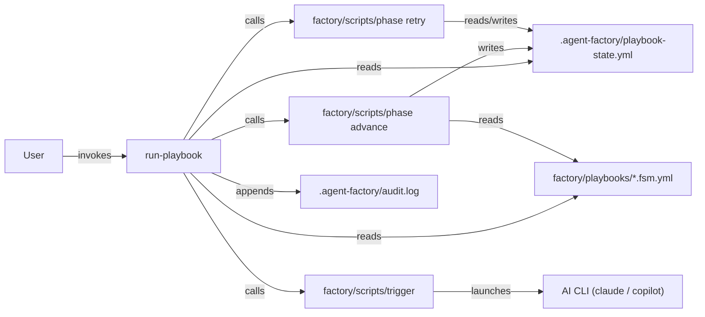

# 5 — Building Block View

## Level 1: run-playbook in context

## Level 2: run-playbook internals

The module has no internal decomposition worth diagramming. It is a single function (`run_one_step`) called in a while loop. Its responsibilities:

| Responsibility                   | Delegated to                                    |
| -------------------------------- | ----------------------------------------------- |
| Read current state               | Marker file (direct read)                       |
| Resolve agent for state          | FSM file (direct read)                          |
| Check if out-gate already passes | `phase advance --dry-run`                       |
| Dispatch agent                   | `trigger agent <name> --background --cli <cli>` |
| Advance marker on gate pass      | `phase advance`                                 |
| Enforce iteration cap            | `phase retry`                                   |
| Write audit entry                | Direct append to `.agent-factory/audit.log`     |

The orchestrator itself contains no condition evaluation, no prompt composition, no agent resolution, and no marker writing logic.
