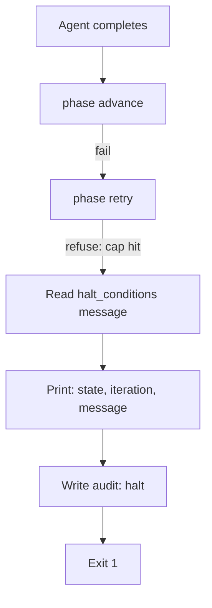

# UC-04 — Halt on Iteration Cap

Realizes: AG-04

## Primary Actor

User (investigates the halt)

## Stakeholders & Interests

- **User** — wants to know that a loop has been exhausted, why, and what to do next.
- **Orchestrator** — wants to stop cleanly with a non-zero exit code that distinguishes a cap-halt from a config error.

## Trigger

`phase retry` returns non-zero after the orchestrator attempted to re-dispatch a state whose out-gate failed.

## Preconditions

- An agent was dispatched and completed (trigger returned 0 or 1).
- `phase advance` failed (out-gate not satisfied).
- The orchestrator called `phase retry`, which refused because the iteration count for this state has reached the limit declared in the FSM's `halt_conditions`.

## Main Success Scenario

1. Agent finishes. Orchestrator calls `phase advance` — fails.
2. Orchestrator calls `phase retry` — returns non-zero (cap hit).
3. Orchestrator reads the FSM's `halt_conditions` for the current state.
4. Orchestrator prints: state name, current iteration count, the halt condition's human-readable `message` field.
5. Orchestrator writes an audit entry with `action: halt`.
6. Orchestrator exits with code 1.

## Extensions

- **3a. No `halt_conditions` entry exists for this state (default cap hit)**
  - 3a1. Orchestrator prints a generic message: "Default iteration cap (5) reached at <state>. Escalate."

## Postconditions

- **Success Guarantee**: the marker remains at the current state (unchanged); the human has a specific escalation message; the audit trail records the halt.
- **Minimal Guarantee**: the orchestrator never loops beyond the cap — this is the circuit breaker's whole purpose.

## Business Rules

- **BR-O10**: A halt on iteration cap is exit code 1. It is distinguishable from a config error (exit code 2) and from a clean stop (exit code 0).
- **BR-O11**: The orchestrator never retries beyond what `phase retry` allows. If `phase retry` refuses, the orchestrator stops unconditionally.

## Activity Diagram



## Acceptance Criteria

```gherkin
Feature: Halt on iteration cap

  Scenario: Halt after 3 failed QA loops
    Given a marker at state PHASE_5_QUALITY with iteration 3
    And the FSM declares max_iterations 3 for that state
    And the out-gate fails after dispatch
    When the orchestrator calls phase retry
    Then phase retry returns non-zero
    And the orchestrator prints the halt message from halt_conditions
    And the orchestrator exits with code 1
    And the marker remains at PHASE_5_QUALITY

  Scenario: Halt message includes state name and iteration count
    Given a halt condition with message "QA looped 5 times. Escalate."
    When the orchestrator halts
    Then the printed output includes "PHASE_5_QUALITY"
    And the printed output includes "5"
    And the printed output includes "Escalate"
```
