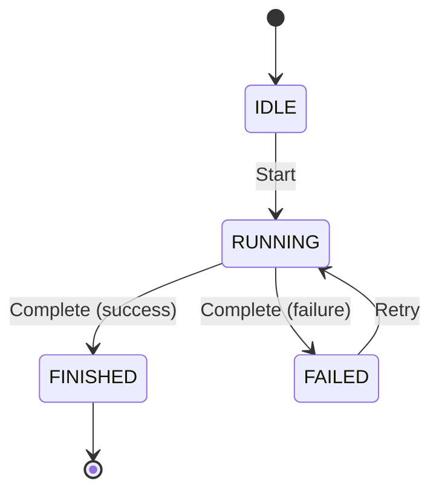

# State Machine Notation

## Canonical Format

State machines **MUST** use event-driven pseudocode as the single source of truth. Mermaid diagrams **MUST** be derived from the pseudocode.

### Required Structure

```
State: STATE_NAME          — declare a state; all following actions belong to it
On EventName:              — event trigger
  if condition             — guard (plain English or domain predicate)
    ChangeState(TARGET)    — explicit transition to TARGET
  else
    ChangeState(OTHER)

SetHaltedFrom(X)           — record X as a possible RestoreState target
RestoreState(var)          — dynamic transition to any state recorded by SetHaltedFrom
RejectCommand("reason")    — refuse the event with a diagnostic
```

## Rules

### **MUST** Requirements

1. **Every `ChangeState(X)` becomes one edge in the Mermaid diagram**
2. **Pseudocode is authoritative** — Mermaid is derived, not hand-drawn
3. **One `State:` declaration per state** — all transitions for that state follow
4. **One `On EventName:` per event** — guards use `if/else`
5. **Mermaid `stateDiagram-v2` syntax** — for consistency with tooling

### **MUST NOT** Violations

1. ❌ **DON'T** write Mermaid first, then reverse-engineer pseudocode
2. ❌ **DON'T** use freeform state transition prose
3. ❌ **DON'T** have mismatches between pseudocode transitions and Mermaid edges
4. ❌ **DON'T** omit guards/conditions from pseudocode when they exist in Mermaid

## Enforcement

Pre-commit hook: `statemachine-lint`

- Parses pseudocode blocks
- Extracts all `ChangeState(X)` calls
- Parses corresponding Mermaid `stateDiagram-v2` blocks
- Verifies every transition appears in both
- **Blocks commit** if inconsistent

## Example: Correct Format

### Pseudocode

```text
State: IDLE
On Start:
  ChangeState(RUNNING)

State: RUNNING
On Complete:
  if success
    ChangeState(FINISHED)
  else
    ChangeState(FAILED)

State: FINISHED
  # terminal — no outbound transitions

State: FAILED
On Retry:
  ChangeState(RUNNING)
```

### Derived Mermaid



## Notes

- **Helper actions** (`CleanWorkingTree`, `IngestFindings`, etc.) are domain operations that do NOT affect state — omit from Mermaid
- **Initial/final pseudostates** `[*]` in Mermaid are diagram conventions — no pseudocode equivalent required
- **`RestoreState(var)`** expands to one edge per `SetHaltedFrom(X)` value in the same block
- **Guards** appear as edge labels in Mermaid (e.g., `: Complete (success)`)

## Why This Format?

1. **Deterministic** — Linting can verify consistency
2. **Single source of truth** — Pseudocode drives diagram, not vice versa
3. **LLM-friendly** — Clear, structured format for generation and validation
4. **Version control** — Textual diffs show state transition changes clearly
5. **Executable** — Can be compiled to state machine implementations

## References

- Source: `orchestrator/docs/spec/supplementary_specs/state-machines.md`
- Enforcement: `scripts/statemachine-lint`
- Hook: `.git/hooks/pre-commit` (if configured)
